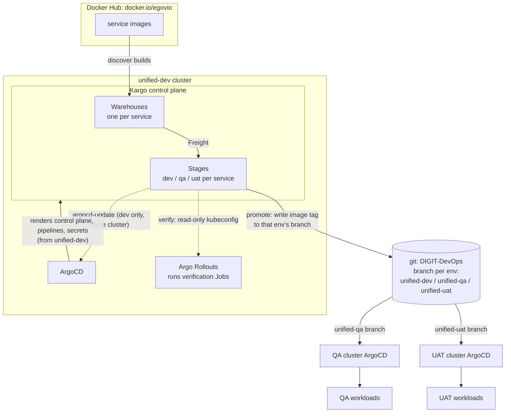
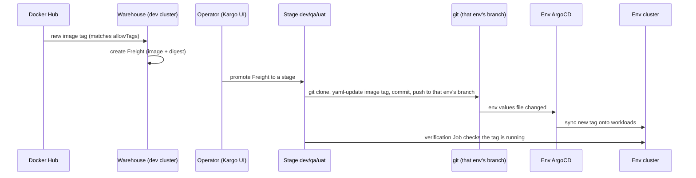

# 1. Overview

[Kargo](https://kargo.akuity.io/) orchestrates image promotion across the unified
environments (DEV, QA, UAT). It watches the container registry for new builds, turns
them into immutable Freight, and moves that Freight through a chain of Stages. Each
promotion writes the new image tag into that environment's **own git branch**, and the
environment's own ArgoCD, which tracks that branch, syncs the change onto its cluster.

The environments use a **branch per environment**: `unified-dev`, `unified-qa` and
`unified-uat`, each holding that environment's values files. A promotion to a stage
commits to that stage's branch (dev to `unified-dev`, qa to `unified-qa`, uat to
`unified-uat`). The Kargo control plane and pipeline definitions themselves are
rendered from the `unified-dev` branch.

Kargo runs on the **unified-dev** cluster (next to that cluster's ArgoCD) and is
reached at **https://kargo.digit.org**.

## Contents

1. Overview (this page)
2. [Setup](2.%20Setup.md): installation, configuration and secrets
3. [Onboarding New Projects](3.%20Onboarding%20New%20Projects.md): projects, services and stages
4. [Role Based Promotion Access](4.%20Role%20Based%20Promotion%20Access.md): SSO and access control
5. [Build and Promotion SOP](5.%20Build%20and%20Promotion%20SOP.md): team guide to login, build tags and promoting

## How it fits together

Kargo never deploys to a cluster itself. It only writes image tags to git; ArgoCD in
each environment does the deploy. That is why one Kargo instance drives DEV, QA and
UAT even though they are separate clusters.

## The model

Two words carry specific meaning here.

**Project = a module.** A Kargo Project is a flat grouping that maps one to one to a
Kubernetes namespace. There is no nesting or sub projects. We run one project per
module:

| Project | Module | Env values files it writes |
|---------|--------|----------------------------|
| `unified-core` | core services | `environments/unified-<stage>.yaml` |
| `unified-health` | health services | `environments/unified-health-<stage>.yaml` |

**Stage = an environment.** Each service has one Stage per environment, named
`<service>-<stage>`, for example `health-individual-dev`. The stages form a chain:
DEV, then QA, then UAT. Each stage promotes (commits the tag) to its environment's
branch: dev to `unified-dev`, qa to `unified-qa`, uat to `unified-uat`.

A service also has one **Warehouse**, which watches that service's image repository
and turns new builds into **Freight** (an immutable image plus digest).

## The parts

| Part | Role | Defined in |
|------|------|------------|
| Control plane | The Kargo API, controller, webhooks and UI | [control-plane.yaml](../../deploy-as-code/helm/charts/kargo/config/control-plane.yaml), installed by [kargo-application.yaml](../../deploy-as-code/helm/charts/argo-cd/unified-dev/kargo/kargo-application.yaml) |
| Pipeline chart | Renders Project, Warehouse, Stage and RBAC from a values file | [charts/kargo](../../deploy-as-code/helm/charts/kargo) |
| Project config | One file per module, lists its services and stages | [config/projects](../../deploy-as-code/helm/charts/kargo/config/projects) |
| ApplicationSet | One ArgoCD Application per project | [kargo-app-set-pipelines.yaml](../../deploy-as-code/helm/charts/argo-cd/unified-dev/kargo/kargo-app-set-pipelines.yaml) |
| Argo Rollouts | Runs the post promotion verification Jobs | [argo-rollouts-application.yaml](../../deploy-as-code/helm/charts/argo-cd/unified-dev/kargo/argo-rollouts-application.yaml) |
| Credentials | Image, git, admin, SSO, verification, from SOPS | [kargo-secret.yaml](../../deploy-as-code/helm/charts/cluster-configs/templates/secrets/kargo-secret.yaml) |

## What happens when a new build appears

## One cluster drives three

The control plane lives only on unified-dev. Promotion is a git write, so it does not
need to reach QA or UAT at all:

- **DEV** shares the cluster with Kargo, so its stages also run an `argocd-update`
  step that refreshes the dev ArgoCD application directly. DEV therefore shows real
  ArgoCD health and an ArgoCD link in the Kargo UI.
- **QA and UAT** are separate clusters. Their stages only push the tag to git; the QA
  or UAT ArgoCD picks it up on its own. Kargo cannot see those clusters' ArgoCD, so
  health for those stages comes from the verification check, not from ArgoCD.

## Promotion is manual and gated

Every stage uses `autoPromotion: false`. An operator picks the Freight and promotes
it, DEV first, then QA, then UAT. A downstream stage only accepts Freight that has
been verified in the stage before it, so a broken build cannot skip ahead.

Tag policy adds a second gate on top of the chain. A single Warehouse per service
discovers both mainline (`master-*`) and feature or ticket builds (per architecture
`-amd64`/`-arm64` children are excluded), so DEV and QA can run either. Stages listed in
`masterOnlyStages` (default `[uat]`) **reject** any non-`master-*` promotion: the
promotion fails (Errors) instead of writing, so a feature build can never reach UAT even
once it is verified in QA. See
[Onboarding New Projects](3.%20Onboarding%20New%20Projects.md) sections 3.5 and 3.6.

## Where everything lives

| Area | Path |
|------|------|
| Pipeline chart | [../../deploy-as-code/helm/charts/kargo](../../deploy-as-code/helm/charts/kargo) |
| Per project config | [../../deploy-as-code/helm/charts/kargo/config/projects](../../deploy-as-code/helm/charts/kargo/config/projects) |
| Control plane install values | [../../deploy-as-code/helm/charts/kargo/config/control-plane.yaml](../../deploy-as-code/helm/charts/kargo/config/control-plane.yaml) |
| ArgoCD applications | [../../deploy-as-code/helm/charts/argo-cd/unified-dev/kargo](../../deploy-as-code/helm/charts/argo-cd/unified-dev/kargo) |
| Credential rendering | [../../deploy-as-code/helm/charts/cluster-configs/templates/secrets/kargo-secret.yaml](../../deploy-as-code/helm/charts/cluster-configs/templates/secrets/kargo-secret.yaml) |
| Environment values files | [../../deploy-as-code/helm/environments](../../deploy-as-code/helm/environments) |
