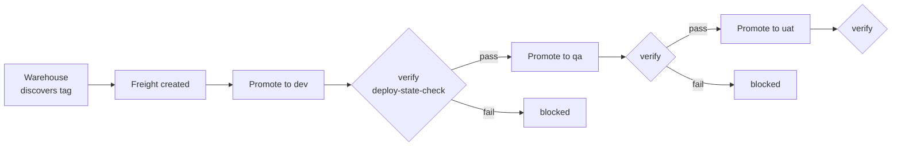

# 3. Onboarding New Projects

How to add a new project (module), add services to a project, and configure their
stages and environment file overrides. See [Overview](1.%20Overview.md) for the model
and [Setup](2.%20Setup.md) for the platform.

Everything here is driven by one file per module in
[config/projects](../../deploy-as-code/helm/charts/kargo/config/projects). The pipeline
chart [charts/kargo](../../deploy-as-code/helm/charts/kargo) turns that file into the
Kargo Project, one Warehouse and one set of Stages per service, and the RBAC objects.

## 3.1 How a project file maps to Kargo objects

A project values file has four blocks:

| Block | Produces | Template |
|-------|----------|----------|
| top level `project`, `registry`, `git`, `argocdAppPrefix` | the Project and defaults | [project.yaml](../../deploy-as-code/helm/charts/kargo/templates/project.yaml) |
| `services:` | one Warehouse per service | [warehouse.yaml](../../deploy-as-code/helm/charts/kargo/templates/warehouse.yaml) |
| `services:` x `stages:` | one Stage per service per stage | [stage.yaml](../../deploy-as-code/helm/charts/kargo/templates/stage.yaml) |
| `teams:` | ServiceAccounts, Roles, bindings | see [Role Based Promotion Access](4.%20Role%20Based%20Promotion%20Access.md) |

Look at a working example before you start:
[unified-core.yaml](../../deploy-as-code/helm/charts/kargo/config/projects/unified-core.yaml)
(small) and
[unified-health.yaml](../../deploy-as-code/helm/charts/kargo/config/projects/unified-health.yaml)
(large, with per service overrides).

## 3.2 Add a new project (module)

Do this when you have a new module whose services deploy from their own environment
values files, for example a hypothetical `unified-works`.

1. **Create the project file**
   `deploy-as-code/helm/charts/kargo/config/projects/unified-works.yaml`. Start from
   `unified-core.yaml` and set the header:

   ```yaml
   kargo:
     project: unified-works          # also the Kubernetes namespace
     registry: docker.io/egovio
     argocdAppPrefix: egov-          # DEV argocd-update app name prefix
     git:
       repoURL: https://github.com/egovernments/DIGIT-DevOps.git
   ```

2. **Register the project** so the ApplicationSet renders an Application for it. Add
   the name to the project list in
   [kargo-app-set-pipelines.yaml](../../deploy-as-code/helm/charts/argo-cd/unified-dev/kargo/kargo-app-set-pipelines.yaml).

3. **Let the AppProject write to the namespace.** Add `unified-works` to the
   `destinations` in
   [kargo-app-project.yaml](../../deploy-as-code/helm/charts/argo-cd/unified-dev/kargo/kargo-app-project.yaml).

4. **Render credentials into the namespace.** Add `unified-works` to the `projects`
   list under `cluster-configs.secrets.kargo` in
   [cluster-configs values.yaml](../../deploy-as-code/helm/charts/cluster-configs/values.yaml),
   so the image, git and verification Secrets are created there (see
   [Setup 2.5](2.%20Setup.md)).

5. Add `services`, `stages` and `teams` as in the sections below, commit, and let
   ArgoCD sync. The new Project appears in the Kargo UI.

## 3.3 Add a service to a project

Each entry under `services:` becomes one Warehouse (image discovery) and, combined with
`stages:`, one Stage per environment.

Minimal entry:

```yaml
services:
  - name: my-service          # also the Deployment name used by verification
    namespace: egov           # namespace the Deployment runs in (per env cluster)
    allowTags: '^master-[0-9a-f]+$'
    discoveryLimit: 20
```

Field reference (defaults in
[values.yaml](../../deploy-as-code/helm/charts/kargo/values.yaml)):

| Field | Meaning |
|-------|---------|
| `name` | Service name. Used for the Warehouse, the Stage prefix, the Deployment name in verification, and the `name.image.tag` key written to the env file. |
| `namespace` | Namespace the Deployment runs in on the target cluster (for verification). Defaults to `verify.namespace`. |
| `repo` | Image repo name if it differs from `name`. The image is `registry/repo`. See 3.4. |
| `allowTags` | Regex of tags to consider. The main cost control. See 3.5. |
| `discoveryLimit` | How many matched tags to surface as Freight. Does not reduce registry calls. |
| `imageSelectionStrategy` | Defaults to `NewestBuild`. |
| `cacheByTag` | `true` makes repeat discovery cycles cheap. Recommended. |
| `freightCreationPolicy` | `Manual` or `Automatic` (default). |
| `interval` | How often the Warehouse re-checks, for example `30m0s`. |
| `dbMigration` | `true` also bumps the `name.initContainers.dbMigration.image.tag` key on promotion. Set it for services that run a migration init container. |

After adding, commit and sync. The new Warehouse starts discovering and its three
Stages appear.

## 3.4 Override the image repository

When the Deployment name and the Docker repo differ, set `repo`. Example: `inbox-v2`
runs the image `egovio/inbox`.

```yaml
- name: inbox-v2       # Deployment and env-file key stay inbox-v2
  repo: inbox          # image pulled from docker.io/egovio/inbox
  namespace: health
```

The template uses `repo | default name` for the image URL and verification `imageFrom`
lookup, while `name` still drives the Stage name and the env file key.

## 3.5 Tag filtering and discovery cost

`NewestBuild` fetches a config blob per matched tag, so the number of matched tags, not
`discoveryLimit`, drives registry calls. `allowTags` is the only lever that reduces
them. Set a tight regex.

Two level model, used by unified-health:

1. **Project default**: set `allowTags` once at the `kargo:` level (sibling of
   `services:`), for example `^master-`. Every service inherits it.
2. **Per service override**: set `allowTags` on a service to replace the default when a
   service is built from a different branch. For example `boundary-service` in
   [unified-core.yaml](../../deploy-as-code/helm/charts/kargo/config/projects/unified-core.yaml)
   uses `^master-persister-changes-2\.0-[0-9a-f]+$`.

Anchor with `$` to exclude per architecture manifest children (`-amd64`, `-arm64`) from
Freight. Keep the matched set to roughly 20 to 40 tags. Pair a tight `allowTags` with an
image credential that has a high pull limit (see [Setup 2.5](2.%20Setup.md)); a loose
filter across many repos is what trips Docker Hub rate limits.

## 3.6 Configure stages and env file overrides

The `stages:` block is shared by every service in the project. Each stage says which
branch and environment values file a promotion writes to, and where its Freight comes
from.

```yaml
stages:
  - name: dev
    color: "#3BA9C2"
    branch: unified-env-lts
    envFile: deploy-as-code/helm/environments/unified-dev.yaml
    autoPromotion: false
    argocdUpdate: true            # DEV shares the cluster: refresh ArgoCD directly
    argocdNamespace: argocd
    verifyKubeconfigSecret: verify-kubeconfig-dev
  - name: qa
    color: "#D64550"
    from: dev                     # only accepts Freight verified in dev
    branch: unified-env-lts
    envFile: deploy-as-code/helm/environments/unified-qa.yaml
    autoPromotion: false
    verifyKubeconfigSecret: verify-kubeconfig-qa
  - name: uat
    color: "#F2C230"
    from: qa
    branch: unified-env-lts
    envFile: deploy-as-code/helm/environments/unified-uat.yaml
    autoPromotion: false
    verifyKubeconfigSecret: verify-kubeconfig-uat
```

Stage fields:

| Field | Meaning |
|-------|---------|
| `name` | Stage name suffix. The Stage is `<service>-<name>`. |
| `color` | UI color for the stage. |
| `from` | The upstream stage this one pulls verified Freight from. Omit on the first stage (it takes Freight directly from the Warehouse). This is what enforces dev then qa then uat. |
| `branch` | Branch the promotion commits to. |
| `envFile` | The values file in that branch whose `name.image.tag` keys are rewritten. This is the override target. |
| `autoPromotion` | Keep `false`; promotion is a manual, gated action. It is rendered into the project's `ProjectConfig` promotion policy (`promotionPolicies[].autoPromotionEnabled`), not onto the Stage itself. |
| `argocdUpdate` / `argocdNamespace` | DEV only: also refresh the in cluster ArgoCD app `<argocdAppPrefix><service>`. Omit for QA and UAT (separate clusters). |
| `verifyKubeconfigSecret` | The per env read only kubeconfig Secret the verification Job uses (`verify-kubeconfig-<env>`). |

### What a promotion writes

For `envFile`, the promotion rewrites `name.image.tag` to the promoted tag, and, when
`dbMigration: true`, also `name.initContainers.dbMigration.image.tag`. The DEV stage
then runs `argocd-update`; QA and UAT rely on their own cluster's ArgoCD to pick up the
commit. See [stage.yaml](../../deploy-as-code/helm/charts/kargo/templates/stage.yaml).

### Verification

When `verify.enabled: true` on the project and a stage sets `verifyKubeconfigSecret`,
the stage runs the `deploy-state-check` AnalysisTemplate after promoting. The Job uses
the mounted read only kubeconfig to confirm the target Deployment is running the promoted
tag and is Ready. Enable it per project:

```yaml
verify:
  enabled: true
```

## 3.7 The promotion workflow



Each promotion is manual in the Kargo UI. A stage only offers Freight that passed the
stage named in its `from`, so a build that failed verification in dev cannot be promoted
to qa.

## 3.8 Checklist for onboarding

- [ ] Project file exists under `config/projects/`.
- [ ] Project name added to the ApplicationSet project list.
- [ ] Namespace added to the AppProject `destinations`.
- [ ] Namespace added to `cluster-configs.secrets.kargo.projects`.
- [ ] Each service has a tight `allowTags` (project default plus overrides).
- [ ] `dbMigration: true` set for services with a migration init container.
- [ ] `repo` set where the image name differs from the service name.
- [ ] Stages point at the correct `envFile` per environment.
- [ ] `teams:` set per [Role Based Promotion Access](4.%20Role%20Based%20Promotion%20Access.md).
- [ ] Committed to `unified-env-lts` and synced; Project and Stages visible in the UI.
