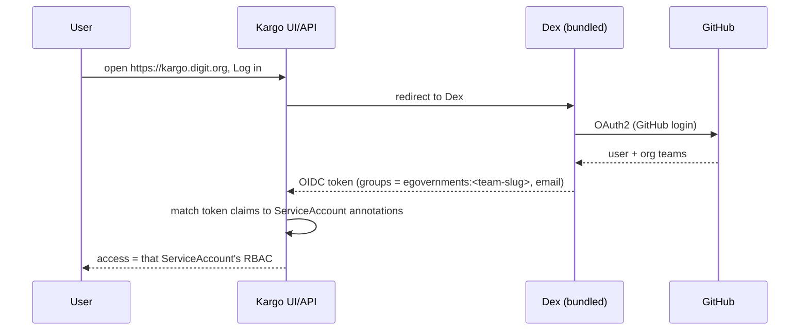

# 4. Role Based Promotion Access

How people sign in to Kargo with GitHub and what each GitHub team is allowed to do.
See [Overview](1.%20Overview.md) for the model and [Setup](2.%20Setup.md) for the SSO
secret.

Access is declared in one place: the `teams:` block of each project file in
[config/projects](../../deploy-as-code/helm/charts/kargo/config/projects). The template
[rbac.yaml](../../deploy-as-code/helm/charts/kargo/templates/rbac.yaml) turns that into
the ServiceAccounts, Roles and bindings Kargo uses.

## 4.1 How sign in works

Kargo has no user database of its own. It authenticates through GitHub and then maps the
GitHub identity to permissions.



Why Dex is in the path: GitHub speaks OAuth2, not OIDC, so Kargo cannot consume it
directly. Dex bridges the two and re-issues a proper OIDC token. This is the same pattern
as ArgoCD and Grafana in this cluster. The Dex connector sets `teamNameField: slug`, so
the `groups` claim is `egovernments:<team-slug>` (for example
`egovernments:micro-service-devops`). Without that, every team would collapse to just
`egovernments` and per project access could not be told apart. The connector config is in
[control-plane.yaml](../../deploy-as-code/helm/charts/kargo/config/control-plane.yaml)
and its GitHub OAuth credentials come from the `kargo-dex-github` Secret (see
[Setup 2.5](2.%20Setup.md)).

## 4.2 How a claim becomes access

Kargo matches a token's claims against `rbac.kargo.akuity.io/claim.<claim>` annotations
on ServiceAccounts, and the caller inherits that ServiceAccount's Kubernetes RBAC.
Because a ServiceAccount lives in one namespace and a Kargo Project is a namespace,
annotating in a project namespace scopes a team to that project only. A team gets nothing
in a project where it is not listed.

For each team entry the template renders two kinds of ServiceAccount:

1. **Project ServiceAccount** in the project namespace, bound to the role. This grants
   the actual rights inside the project.
2. **Global ServiceAccount** in the `kargo` namespace, carrying the same claim, bound to
   the cluster `kargo-user` role. This is what lets the user see the project in the UI
   list at all. `projects.kargo.akuity.io` is cluster scoped, and Kargo only consults
   ServiceAccounts in the global namespace for cluster scoped reads, so a project only
   binding would leave the user logged in but looking at an empty project list.

Both are Helm owned and separate from the `kargo-admin`, `kargo-promoter` and
`kargo-viewer` ServiceAccounts that Kargo creates itself, which avoids a reconcile fight
over controller owned objects.

## 4.3 Declaring team access

Add entries under `teams:` in the project file. Example from
[unified-core.yaml](../../deploy-as-code/helm/charts/kargo/config/projects/unified-core.yaml):

```yaml
teams:
  - name: devops
    role: admin
    groups: [egovernments:micro-service-devops]
  - name: core-devs
    role: promoter
    groups: [egovernments:unified-dev]
```

Fields:

| Field | Meaning |
|-------|---------|
| `name` | A short label for this entry. Used in the generated object names; need not match the GitHub team. |
| `role` | `admin`, `promoter` or `viewer`. An invalid value fails the Helm render. |
| `groups` | One or more GitHub teams as `egovernments:<team-slug>`. |
| `emails` | Optional. Named individuals by email, for when you cannot use a whole team. Matches the `email` claim. |
| `promoteStages` | Optional, `role: promoter` only. Limits promotion to the listed environments. See 4.5. |

A team must set `groups` and/or `emails`, otherwise nobody can match it.

## 4.4 The three roles

| Role | Can do | Bound to |
|------|--------|----------|
| `viewer` | Read the project: stages, warehouses, freight, analysis runs. No promotion. | stock `kargo-viewer` |
| `promoter` | Everything a viewer can, plus promote Freight between stages. | stock `kargo-promoter`, or a generated Role when `promoteStages` is set |
| `admin` | Full control of the project. | stock `kargo-admin` |

The stock roles are created per project by Kargo itself; the team ServiceAccounts bind to
them so permission sets stay standard.

## 4.5 Stage scoped promoters

To let a team promote only to certain environments, keep `role: promoter` and add
`promoteStages` naming the environments (the entries under `stages:`, that is `dev`,
`qa`, `uat`), not individual Stage objects. This is the pattern `unified-health` uses:
one viewer team for the whole module, plus a separate promoter team per environment, as
in
[unified-health.yaml](../../deploy-as-code/helm/charts/kargo/config/projects/unified-health.yaml):

```yaml
teams:
  - name: health-devs            # whole team: read the project, promote nothing
    role: viewer
    groups: [egovernments:unified-health-dev]
  - name: health-dev-promoters   # may promote to dev only
    role: promoter
    promoteStages: [dev]
    groups: [egovernments:unified-health-dev-promote]
  - name: health-qa-promoters    # may promote to qa only
    role: promoter
    promoteStages: [qa]
    groups: [egovernments:unified-health-qa-promote]
  - name: health-uat-promoters   # may promote to uat only
    role: promoter
    promoteStages: [uat]
    groups: [egovernments:unified-health-uat-promote]
```

The template generates a Role named `team-<name>` that grants `promote` on exactly the
matching Stage objects. Stage objects are per service and named `<service>-<stage>`, so
the template expands `qa` to every `<service>-qa` automatically. That means adding a
service needs no RBAC edit, and a typo in `promoteStages` fails the render rather than
silently granting nothing. A team that sets `promoteStages` with any role other than
`promoter` also fails the render.

## 4.6 Add or change access, step by step

1. Decide the GitHub team slug (visible in the team URL on GitHub) and the role.
2. Add or edit the entry under `teams:` in the project file.
3. For partial promotion rights, use `role: promoter` with `promoteStages`.
4. Commit to `unified-env-lts` and let ArgoCD sync. The ServiceAccounts, Roles and
   bindings are created or updated.
5. The user signs in at https://kargo.digit.org with GitHub; access takes effect on their
   next login.

Removing a team from `teams:` removes its ServiceAccount in that project, which removes
its access there. Access in other projects is unaffected because each project declares its
own list.

## 4.7 Notes and limits

- Access is per project. The same GitHub team can have different roles in different
  projects; just list it in each with the role you want.
- Every authenticated user can see the names of all projects (a side effect of the
  cluster scoped project list), but not their contents. Without a role in a project, its
  stages and freight stay hidden.
- The shared admin account stays enabled as a fallback (see
  [Setup 2.2](2.%20Setup.md)). Once SSO is confirmed for all teams it can be disabled so
  the shared password is no longer a way in.
